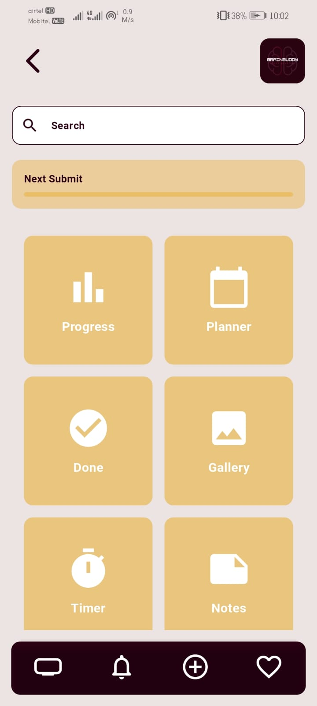
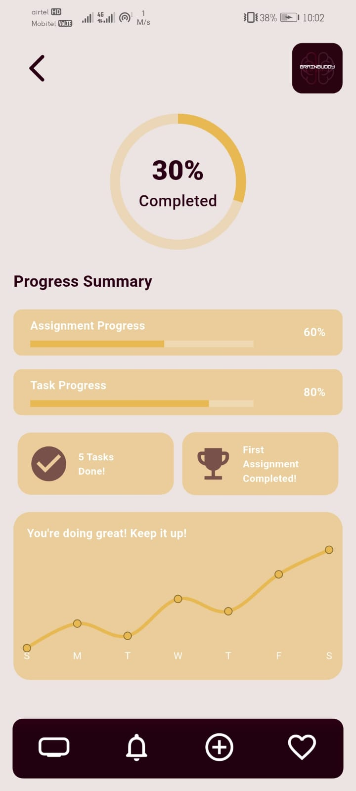
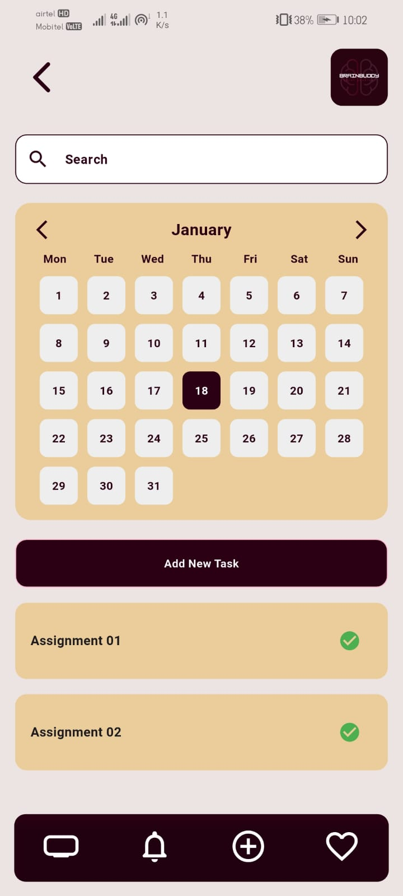
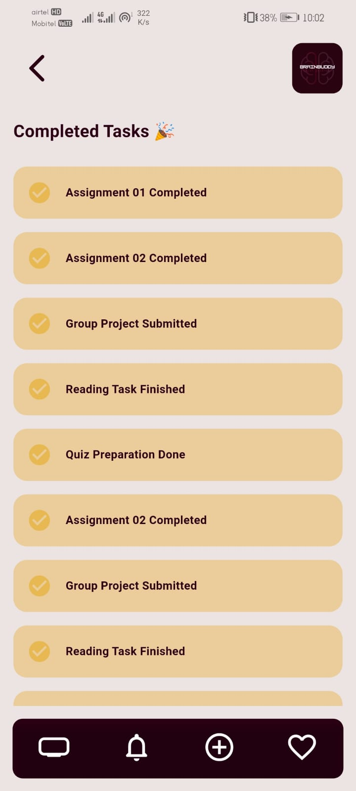
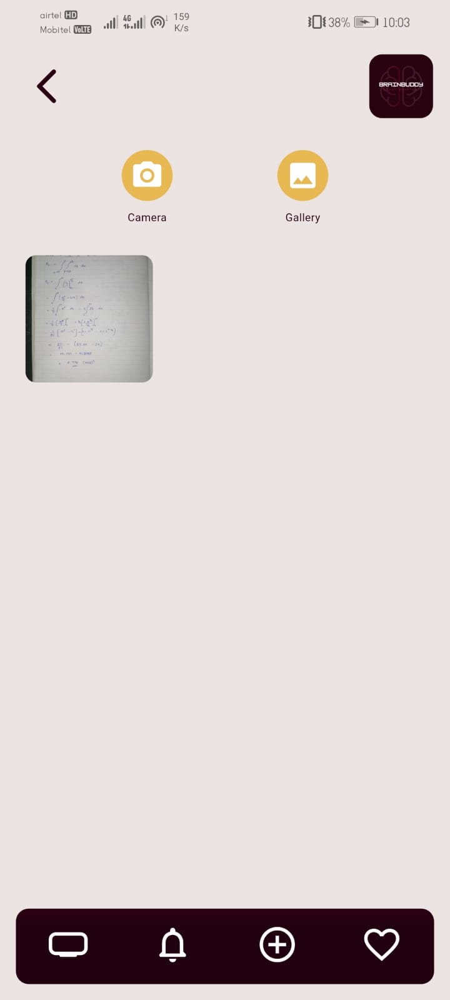
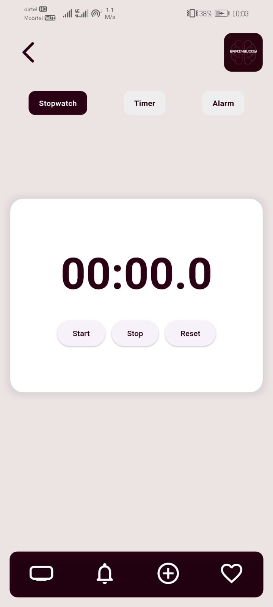
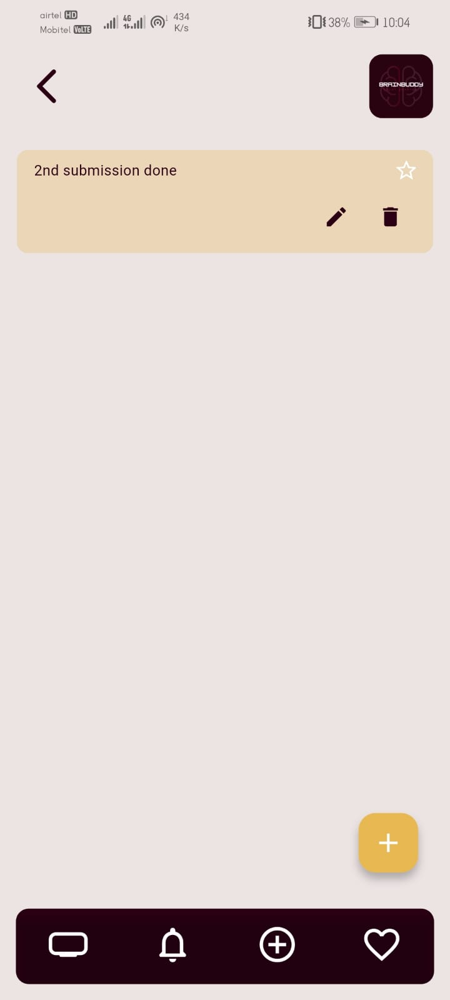
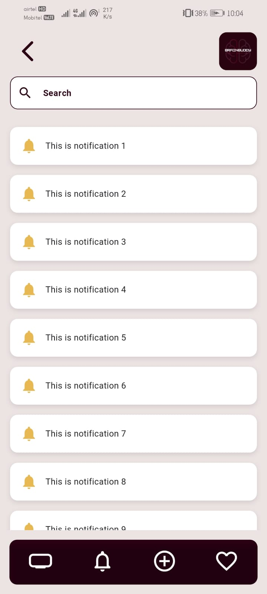
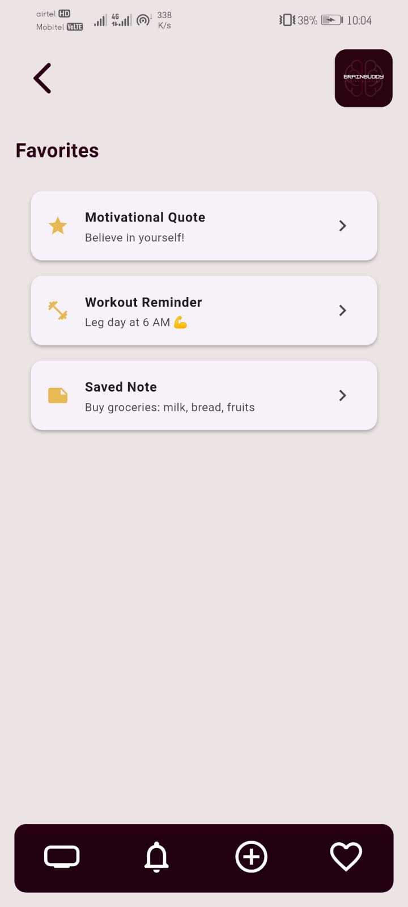

# 🧠 BrainBuddy – Study Smarter

**BrainBuddy** is a smart study planner app built with Flutter to help students organize their time, tasks, and focus sessions efficiently. It combines productivity tools like timers, planners, notes, and motivational tracking into a clean, user-friendly interface.

---

## 📱 App Demo

🚀 [**Coming Soon – Live APK or Play Store Link**](#)

---

## 🎨 Figma UI Design

🎨 [**Figma File**](https://www.figma.com/design/tL21LAmEuRKHOPkpffmzdJ/Car-Rental-Web-Platform?node-id=0-1&t=7i9FlteWQ6md6hUu-1)

---

## 🖼️ Preview

| 🏠 Home | 📈 Progress | 🗓️ Planner |
|--------|------------|-------------|
|  |  |  |

| ✅ Done | 🖼️ Gallery | ⏱️ Timer |
|--------|------------|------------|
|  |  |  |

| 📝 Notes | 🔔 Notifications | ⭐ Favorites |
|-----------|------------------|--------------|
|  |  |  |

> 📁 Place all `.jpg` files directly in the project root or wherever your README can access them.

---

## ✨ Key Features

- ✅ **Planner & Task Manager** – Organize your study sessions  
- ⏱️ **Timer** – Stay focused with session-based study  
- 📊 **Progress Tracker** – Visual feedback on your productivity  
- 📝 **Notes** – Save quick ideas, formulas, or revision points  
- ⭐ **Favorites** – Mark important tasks or notes  
- 🔔 **Smart Notifications** – Stay on track with reminders  
- 🖼️ **Gallery** – View saved screenshots or study boards  
- ✅ **Done List** – Keep track of completed tasks  

---

## 🛠️ Tech Stack

- **Flutter** – Cross-platform development  
- **Dart** – Programming language    
- **Figma** – UI/UX design  

---

## 🚀 Getting Started

```bash
git clone https://github.com/yourusername/brainbuddy.git
cd brainbuddy
flutter pub get
flutter run
